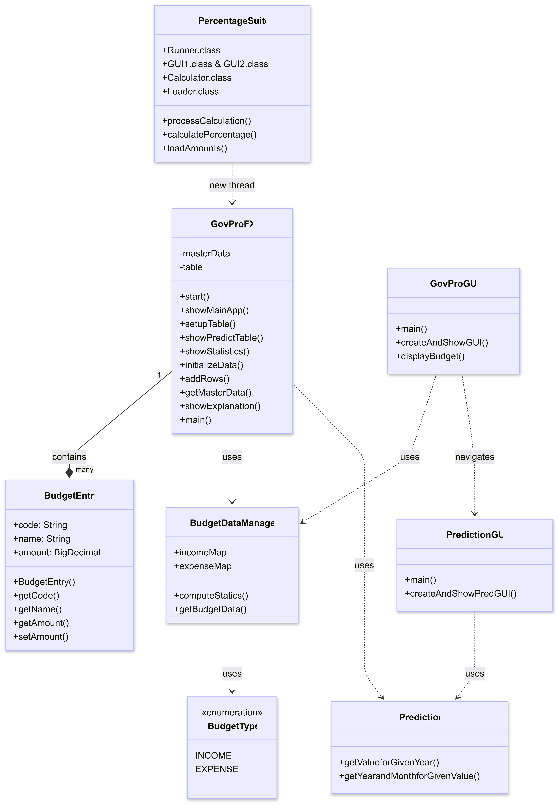

# GovPro Budget System 2025
## *"Data from the state, insights for all."*

**GovPro** is a Java-based application designed to process, analyze, and present data from the Greek state budget in a clear and accessible way. It aims to make financial information understandable for all users, regardless of technical expertise.

## Goal & Mission
GovPro is built with the mission of delivering public financial information in the simplest and most transparent form possible—so every citizen, student, researcher, or professional can easily understand how 
national resources are used.

## Installation & Execution

### Prerequisites
* **Java Development Kit (JDK) 17** or higher.
* **Apache Maven** installed and configured in your system's PATH.

### Installation & Compilation
The project uses **Maven** for build and dependency management. To compile the source code and download necessary libraries (JavaFX, Apache Commons CSV, JUnit), follow these steps:
1. Open a terminal/command prompt in the project's root directory.
2. Run the following command:
   `mvn clean install`

### Execution Instructions
To launch the application, use the following command:
    `mvn javafx:run`
Alternatively, if you have generated a JAR file:
`java -jar target/GovPro.jar`

## Repository Structure
* `src/main/java`: Core application logic (Packages: `entities`, `expenses`, `incomes`, `forecasting` and other `.java` classes).
* `src/main/resources`: UI assets, sound clips (`.wav`), and the budget database (`liga2025.csv`).
* `src/test/java`: Automated JUnit and TestFX test suites.
* `pom.xml`: Maven configuration and dependency management.
* `LICENSE`: Apache lisense for the app usage.
* `UML_Diagram.png`: The visualized UML Diagram of the GovPro App.
* `CODE_OF_CONDUCT.md` & `CONTRIBUTING.md`: Files dedicated to present our promised pledges and a step by step guide to participate in developing code.  

## UML Diagram

## Usage Instructions

The **GovPro** application provides a multi-window interface for interacting with the Greek State Budget. Follow the steps below to utilize all 5 system features:

### 1. Navigating the Budget Table
* **Startup:** After the animated Splash Screen, the main dashboard will appear and immediately see a full list of 2025 budget entries.
* **Color Coding:** For quick recognition, rows are highlighted as follows:
    *  **Green:** Income items.
    *  **Red:** Expense items.
    *  **Blue:** State Entities/Ministries.

### 2. Amendments
* **Modify Data:** Click the **"Make Changes"** button.
* **Interaction:** A dialog box will prompt you to select an entity and enter a new amount.
* **Data Integrity:** These changes update the `TableView` and current statistics in real-time. 
* *Note:* Due to the "Architectural Isolation" design, these changes do not affect the historical forecasting engine, ensuring the predictive core remains anchored to verified data.

### 3. Using the Forecasting Engine
* **Access:** Click the **"Forecasting Engine"** button from the main menu.
* **Predicting Amount:** Enter a future year (e.g., `2027`) to calculate the estimated expenditure based on Linear Regression.
* **Predicting Time:** Enter a specific monetary goal to estimate the exact year and month that amount will be reached.

### 4. Exploring the Statistics Dashboard
* **Visual Analysis:** Clich the **"Statistics Dashboard"** button to see the distribution of funds.
* **Yearly Toggle:** Select between the years **2022, 2023, or 2024** to view historical snapshots.
* **Charts:** The dashboard uses **Pie Charts** for overall distribution and **Progress Bars** for detailed category participation.

### 5. Percentage Calculator Suite
* **Additional Instructions** A welcoming window descriding in detail how to use the feature. 
* **Comparison:** Enter two or more specific budget codes into the provided text fields.
* **Calculation:** The tool fetches raw data and calculates the percentage ratio.
* **History:** All successful calculations are saved in the sidebar for easy comparison during your current session.

### 6. Multimedia & UI Features
* **Audio Feedback:** The system provides sound notifications (AudioClips) upon successful completion of tasks or errors.
* **Transitions:** The interface utilizes `FadeTransitions` for smooth navigation between different modules.

### Key Features

* **1. View Budget Table:** A detailed, color-coded display of budget items using `StringBuilder` for high-performance data reporting and memory efficiency.
* **2. Make Changes:** Allows users to modify budget amounts through dialog windows, utilizing `BigDecimal` to ensure absolute financial precision.
* **3. Forecasting Engine:** Employs Linear Regression (Ordinary Least Squares) to predict future spending or estimate the year a specific financial goal will be met.
* **4. Statistics Dashboard:** Features dynamic Pie Charts and progress bars to visualize the distribution of income and expenses organized by fiscal year (2022–2024).
* **5. Percentage Calculator:** A standalone tool with a custom CSV loader and robust error handling to calculate and compare percentage ratios between multiple budget codes.

# Technical Report
## 1. Functionality

The functionality of the **GovPro** application is based on the transition from a static working environment to a dynamic, multi-window **JavaFX** architecture, aimed at managing the state budget for the year 2025, offering five main features:

### 1.1 View Budget Table
A detailed table presenting key elements by code, description, and amount in euros. For the formatting of these reports, the `StringBuilder` class is utilized to aggregate all data from the table into a single text body in a memory-efficient manner.

### 1.2 Make Changes
Allows the modification of amounts for various budget items through dialog windows. The correct operation of these changes is verified via unit testing using the `BigDecimal` class for maximum precision.

### 1.3 Forecasting Engine
Consists of two sub-functions implemented for state entities:
* **A)** Price prediction for a given year (with year input from the user).
* **B)** Prediction of the year a specific amount will be achieved (with amount input from the user).

This is achieved by integrating forecasting algorithms based on data samples, implementing a **Linear Regression** mechanism using the ordinary least squares method. The system automatically calculates regression coefficients by analyzing actual expenditures from 2022 to 2025 for 11 different state entities and performs year normalization, with 2021 as the base year, for greater accuracy.

### 1.4 Statistics Dashboard
Displays statistical information for the two largest economic groups of the budget: income and expenses. It presents a percentage analysis of their components, an intuitive pie chart, and visualized distribution views for the respective statistical elements of each category, organized by year (e.g., 2022, 2023, 2024). This is displayed in a separate window (Stage) using JavaFX elements such as `HBox`, `VBox`, and `TextArea`.

### 1.5 Percentage Calculator
A tool for calculating percentage ratios between one or more budget items. The implementation integrates a custom **Data Loader**, which handles data reading from a CSV resource file and includes a comprehensive exception package (`ArithmeticException`, `FileNotFoundException`, `NullPointerException`, `NumberFormatException`) along with its own JavaFX GUI.

## 2. Architectural Diagram

GovPro follows a **Layered Architecture** pattern to ensure complete separation of concerns across three distinct levels:

### 2.1 Data Layer (System Feed)
* **Class Hierarchy:** Organized into 3 packages (Income, Expenses, Entities) using inheritance from "parent" classes for specialized budget sub-classes.
* **Object Creation (Factory Mechanism):** Raw financial data from 2D `Object[][]` arrays are processed through centralized methods in `ObjectsEntities.java`, `ObjectsIncomes.java`, and `ObjectsExpenses.java` to generate dynamic `ArrayLists`.
* **Data Lifecycle & Flow:** Implements **Strict Casting** to convert static data into `BigDecimal` objects. Utilizing **Setters** ensures that memory changes reflect immediately across the system. This collection serves as the **"Single Source of Truth"** for both the Forecasting Engine and the Presentation Layer.

### 2.2 Logic Layer (Core Processing)
* **2.2.1 Budget View:** Populates `ObservableList<BudgetEntry>` for the UI. Features **Conditional Styling** (Green for Income, Blue for Entities, Red for Expenses) for immediate visual categorization.
* **2.2.2 Amendments:** Uses `Scanner` within a `try-catch` block to handle updates. It captures `InputMismatchException` to prevent crashes during manual data entry, ensuring valid numerical input via `while` loops.
* **2.2.3 Forecasting Engine:** Employs **Simple Linear Regression** (y = a + bx) using the least squares method. It performs year normalization (base 2021) to calculate estimated expenditures or target dates.
* **2.2.4 Statistics Dashboard:** Follows a Centralized Data Management pattern using `HashMaps` for instant retrieval of data (2022-2024). Calculations use `RoundingMode.HALF_UP` with 8-decimal precision. Results are visualized via **Pie Charts** and **Progress Bars**.
* **2.2.5 Percentage Calculator:** A standalone suite utilizing **Java Streams** and the `reduce` operation for aggregate calculations. It features a custom CSV loader (Apache Commons CSV) and a robust exception handling package.

### 2.3 Presentation Layer (JavaFX UI)
* **Framework:** Transitioned from Swing to **JavaFX** for a modern, multi-window architecture using `Stage` and `Scene` objects.
* **Real-time Data:** Uses `ObservableList` to automatically sync the `TableView` with data changes.
* **Multi-threading:** Offloads heavy calculations (e.g., the Percentage Runner) to separate **Background Threads** to keep the **Main UI Thread** responsive and prevent "freezing."
* **Multimedia & Layout:** Integrates `AudioClip` for user feedback and `FadeTransition` for splash screens. Layouts are managed via `BorderPane`, `VBox/HBox`, and `ScrollPane`.

### 2.4 Build & Dependency Management (Maven)
* **Ecosystem:** Manages `javafx-controls`, `javafx-fxml`, and `javafx-media`.
* **Quality Assurance:** Employs **JUnit 5** for unit testing and **TestFX** for automated UI testing.
* **Data & Build:** Uses **Apache Commons CSV** for resource parsing and the **Maven Surefire Plugin** to manage the test lifecycle and define the `GovProFX` entry point.

## 3. Limitations

Despite its robust architectural structure, the current implementation of the system is subject to the following limitations:

* **3.1 Interface Binding (Modality Lock):** The use of `Modality.APPLICATION_MODAL` in certain dialog windows (such as the amendment process) prevents the user from minimizing the window or interacting with the rest of the application until the current action is closed.
* **3.2 Financial Accuracy Constraints:** While the system uses `BigDecimal` for main financial entities, the forecasting engine (`Prediction.java`) relies on `double` types for linear regression calculations. This may introduce infinitesimal rounding errors in extreme expenditure scales, unlike the absolute precision offered by `BigDecimal` in the main table.
* **3.3 Static Historical Data:** The predictive model is based on a predefined data array (`dapanes`) covering the years 2022-2025. The application does not support dynamic insertion of new historical years by the user during runtime.
* **3.4 Absence of Deflation Index:** Machine forecasts are based on nominal values. Without an integrated deflation mechanism, future estimates may show a "fictitious" increase in spending due to inflation rather than a real change in economic magnitudes.
* **3.5 Synchronization Limitations:** The `AmendmentEntities` class uses a `while` loop and the `Scanner` class, which "freezes" console execution until data is entered. This makes this specific function incompatible with the parallel execution of other background processes, unlike the multithreaded model of JavaFX.
* **3.6 Static Graphics:** JavaFX charts (`PieChart`), although dynamic regarding data, do not support zoom functions or detailed mouse-over analysis in the current version. Users see a static distribution without the ability to "drill down" into a category.
* **3.7 Responsive Design:** The layout relies on `BorderPane` and `Box` containers with fixed sizes. The application lacks full Responsive Design, meaning that on very small screens or extreme window resizing, certain elements (like the table or statistics) may not adjust ideally.
* **3.8 OS Dependency:** JavaFX utilizes hardware acceleration. On outdated systems, transition performance may exhibit delays or lag.

## 4. Risks of Use

### 4.1 The "Double-Edged Sword" of Data Modification
The Amendment feature is the most controversial part of the application, oscillating between utility and risk:
* **Flexibility:** The ability to instantly change amounts is an essential feature, allowing the budget to be adjusted according to user preferences. It is a dynamic planning tool that grants excellent control.
* **Arbitrariness:** Conversely, this freedom poses a risk as the system lacks a verification mechanism. Users may enter "logical inaccuracies" (incorrect or unrealistic amounts), compromising budget integrity. The line between a valid test change and a catastrophic distortion of information is extremely thin.
* **The "Architectural Isolation" Solution:** This gray area is mitigated by the fact that calculations draw amounts from the original static arrays, ignoring GUI changes. This acts as a critical safety valve, ensuring that long-term estimates are always based on valid and verified historical data. GUI modifications serve as an "added feature" for visual experimentation without altering the core computational engine.

### 4.2 Inflationary Distortion and the "Illusion of Growth"
The most significant economic risk arises from processing nominal values. A user might assume a sector is being strengthened because its funding increases, while in reality, due to inflationary trends, it is being downgraded in terms of purchasing power.

### 4.3 Linear Simplification of Complex Economic Phenomena
The use of Simple Linear Regression is a mathematical approach that does not always reflect reality. The algorithm does not account for extraordinary events (pandemics, energy crises, geopolitical changes) that cause exponential shifts or sharp declines.

### 4.4 Technical Instability and "Race Conditions"
Due to Multi-threading in the Percentage Calculator, a latent technical risk exists. Although JavaFX manages the UI Thread, simultaneous access to shared resources without a strict locking mechanism may lead to temporary "freezing" or incorrect result display in the `ListView`.

### 4.5 "Black Box" Effect
The "Black Box" risk lies in the user's tendency to blindly trust results simply because they were "computer-generated," accepting regression outcomes as absolute truth while ignoring the underlying mathematical assumptions.

### 4.6 Data Range Limitations
There is a risk of precarious extrapolation. Predictions for 2030 or 2040, based on only 4 years of historical data (2022-2025), are statistically risky as the margin of error increases exponentially the further we move from the actual data range.

## 5. AI Interaction and Collaborative Development

The development of the **GovPro** system involved a strategic collaboration between the lead developers and Generative AI (GAI) tools. Rather than outsourcing the creative process, AI was utilized as a "thought-partner" to accelerate refactoring from legacy frameworks to modern architectures and to ensure economic rigor in predictive modeling.

### 5.1 Refactoring and Logic Migration
The transition from a monolithic Swing interface to a modular JavaFX environment was facilitated by AI-assisted code decomposition.
* **Method Extraction**: AI was prompted to identify discrete logic blocks within legacy `switch-case` structures and propose independent JavaFX methods such as `showBudget()`, `showAmendDialog()`, `showPredictionWindow()`, and `showStatisticsWindow()`.
* **UI Modernization**: The collaboration focused on replacing static `JOptionPane` dialogs with more flexible JavaFX `Dialog` or `Alert` components to improve user flow.

### 5.2 Technical Debugging and Dependency Management
AI was leveraged to resolve environment-specific configuration hurdles and ensure project stability.
* **Maven Configuration**: Provided AI with existing `pom.xml` snippets to verify the correct implementation of the `javafx-maven-plugin` and ensure the `mainClass` declaration pointed correctly to `GovProFX`.
* **Namespace Resolution**: AI assisted in verifying `package declarations` across the project structure, such as ensuring `FixedAssetsExp.java` correctly resided within the `expenses` package to prevent compilation errors.

### 5.3 Economic Modeling and Validation
A key area of human-AI synergy was the integration of economic theory into the software’s predictive engine.
* **Formula Verification**: Validated the importance of using deflated values in predictive models to avoid biased estimates, especially when data covers multiple years with varying inflation levels.
* **Formula Adaptation**: Confirmation of the correct type implementation for the Simple Linear Regression model, ensuring compatibility with the diverse data of the 'Single Source of Truth' while adhering to established economic and statistical standards.

### 5.4 Collaborative Development of the Percentage Suite
The development of the **Percentage Suite** served as a primary example of human-AI synergy, focusing on data integrity and statistical rigorousness.
* **Thread Integration**: AI assisted in structuring the `PercentageSuite` class to handle asynchronous data loading from CSV files without blocking the main JavaFX thread and enabling simultaneous execution.
* **Statistical Validation**: AI was utilized to provide a validated implementation for the calculation model, ensuring compatibility with domain standards.
* **Advanced Exception Handling**: The developer and AI collaborated to implement a robust variety of exceptions. This system was specifically designed to catch and manage a suite of 11 distinct exceptions.
* **Validation**: This collaboration led to a seamless validation layer where the `PercentageSuite` can now verify calculation integrity across multiple pairs of sumed (or not) budget sub-classes and print the desired percentage.

### 5.5 Quality Assurance through Unit Testing
The partnership extended to the testing phase, focusing on precision and robustness.
* **Test Case Generation**: AI assisted in drafting JUnit test cases to verify that the constructor correctly stores attributes like code, name, and amount.
* **Precision Handling**: Based on AI recommendations and code snippets, the system utilized `BigDecimal` for financial attributes (e.g., `new BigDecimal("1000.00")`) to eliminate the rounding errors inherent in `double` types.
* **Behavioral Validation**: AI helped verify that getters and setters function correctly and that descriptive methods like `toExplain()` provide human-readable context.

## 6. Documentation of Third-Party Licenses

The **GovPro** application utilizes several open-source libraries and frameworks to ensure reliable dependency management. Below is the list of all necessary licenses required for the operation and distribution of the software:

* **OpenJDK (GPL v2 with Classpath Exception)**: Provides the core Java runtime environment and standard libraries (e.g., `java.util`, `java.math.BigDecimal`) used for the application's logic and financial calculations.
* **OpenJFX / JavaFX (GPL with Classpath Exception)**: The primary framework for the graphical user interface, enabling the use of `Stages`, `Scenes`, and modern UI controls like `TableView` and `ObservableList`.
* **Apache License 2.0 (Maven & Plugins)**: Governs the use of the `javafx-maven-plugin` and the Maven build system, which automates project lifecycle management and dependency resolution.
* **JUnit 5 (Eclipse Public License 2.0)**: Utilized for the implementation of the Unit Testing suite (e.g., `testAllocatedFunds`) to ensure code quality and the integrity of the "Single Source of Truth".
* **Oracle Binary Code License (Legacy Swing/AWT)**: Covers the use of legacy components from the `javax.swing` and `java.awt` packages during the refactoring phase of the prediction modules.

## 7. Automated Testing Suite and Unit Testing with JUnit 5

To ensure the reliability and stability of the **GovPro** application, a comprehensive automated testing suite was implemented using the **JUnit 5** framework. These unit tests focus on verifying individual components of the program, ensuring that any refactoring or logic migration does not introduce regressions.

### 7.1 Testing Scope and Objectives
The primary objective of the testing suite is to validate the integrity of the "Single Source of Truth" by auditing the core data structures and their associated logic. Key focus areas include:
* **Object Instantiation**: Verifying that the `ObjectFactory` correctly instantiates objects with strict type-casting.
* **Data Accuracy**: Ensuring that financial attributes using `BigDecimal` maintain precision throughout the program's lifecycle.
* **Method Behavior**: Validating the output of descriptive methods and the functionality of getters and setters.

### 7.2 Implementation: The `testAllocatedFunds` Case
A central part of the suite is the `testAllocatedFunds()` method, which serves as a benchmark for the application's data layer.
* **Constructor Validation**: The test confirms that when an `AllocatedFunds` object is created, the `Code`, `Name`, `Amount`, and `Form` are stored exactly as provided.
* **State Mutation**: Tests verify that setters correctly update values and that these changes are reflected accurately by the getters.
* **Human-Readable Context**: The suite includes assertions for the `toExplain()` method, confirming it returns the expected string which validates that the object's purpose is correctly communicated.

### 7.3 Testing for Refactoring Safety
Since the project involved significant migration from Swing to JavaFX, the JUnit 5 suite acted as a "safety net."
* **Regression Testing**: By running the full suite after each code change, the developer ensured that logic moved from legacy `switch-case` blocks into new JavaFX methods remained functionally identical.
* **BigDecimal Integrity**: Specific tests were designed to catch potential errors during the transition from `double` to `BigDecimal`, ensuring that no rounding discrepancies occurred in the budget's final totals.

### 7.4 Test Execution and Build Integration
The testing process is fully integrated into the project's lifecycle through **Maven**. 
* **Automated Execution**: Running the command `mvn test` triggers the entire suite, providing immediate feedback on the health of the application.
* **Test-Driven Development Approach**: The use of `assertEquals` and `assertNotNull` throughout the development process ensured that every new feature met the pre-defined statistical and economic standards before integration into the main branch.

## Final Remarks

In conclusion, the **GovPro** application is a powerful tool for strategic visualization and trend analysis, offering valuable insights into the course of fiscal magnitudes. However, its use is purely explanatory and advisory. Its value lies in its ability to visualize complex data and highlight statistical correlations that often escape a simple reading of accounting tables. It functions best as a **Decision Support System** rather than a platform for deterministic outcomes. This sofisticatted model makes **human judgment essential** for the final evaluation of results.